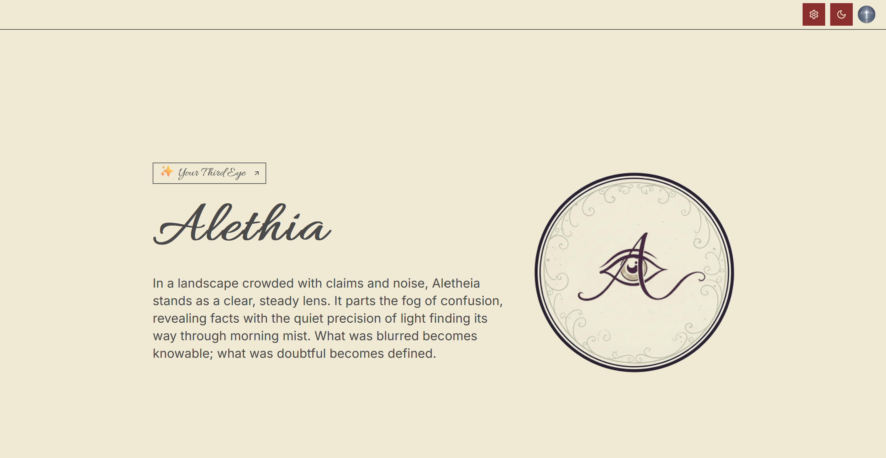
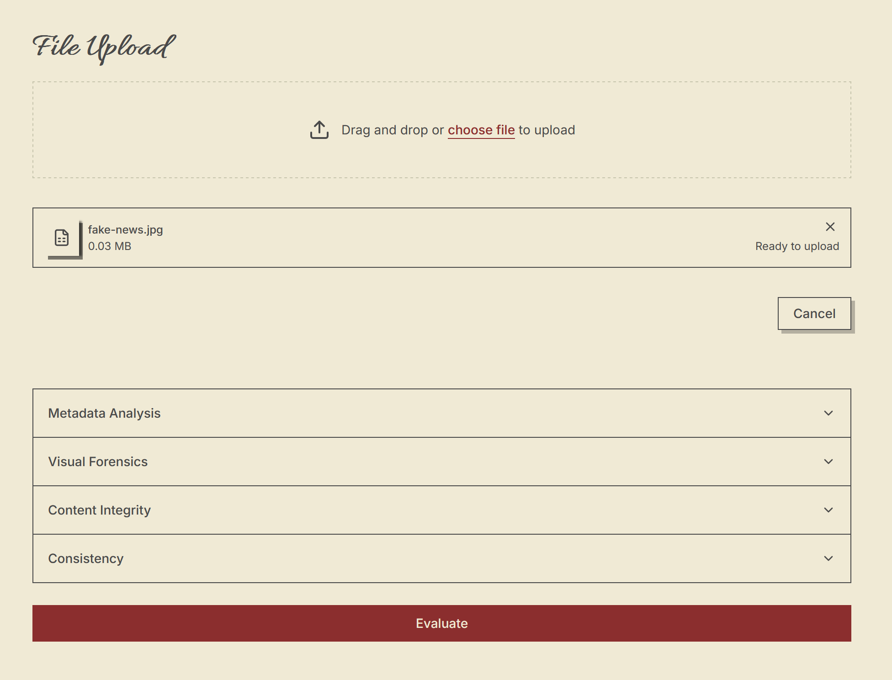
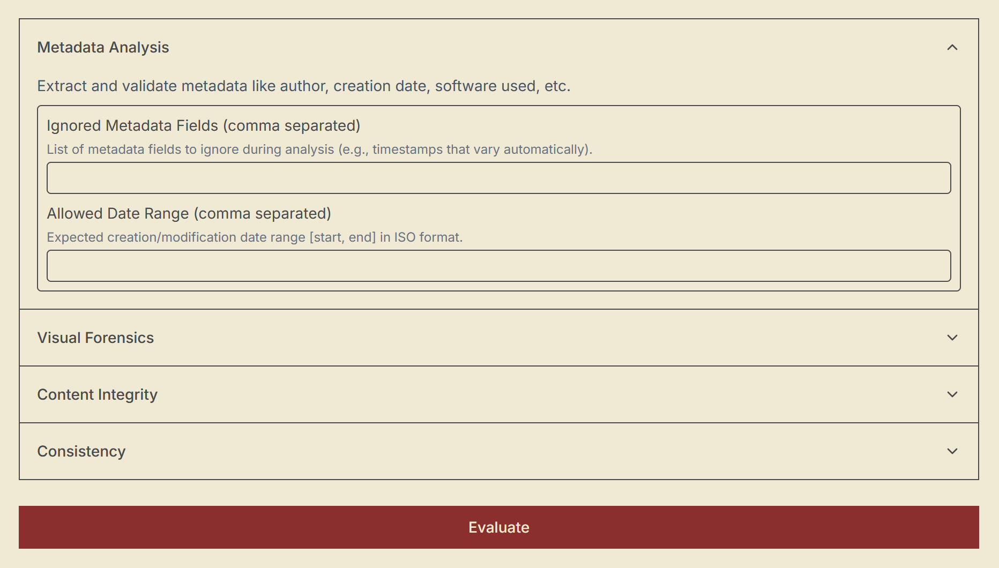
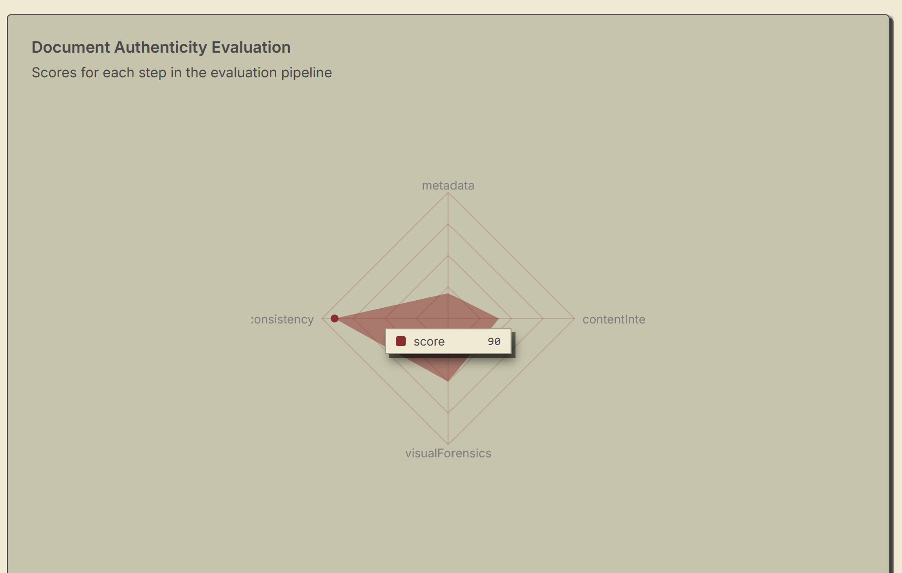

# **Alethia — Technical Overview**


- The icon at the top right is my email profile picture, provided by clerk auth.


## **General Description**

Alethia is a document authentication platform built by extending two foundational templates—one for the frontend (we added the folder ./frontend/src/app/(main)/home, the opencv feature (in the features folder) and the pipeline store (in the hooks folder)) and one for the backend (we implemented the opencv module). 

We designed a full workflow that ingests a document, analyzes it across multiple dimensions, and presents a structured evaluation of its authenticity.

After a document is uploaded, it is processed through a configurable **authentication pipeline**. Each pipeline stage evaluates a specific aspect of the document—metadata consistency, visual integrity, text coherence, and other forensics indicators.




Once the pipeline completes, Alethia generates:

* **A radar chart** summarizing the document’s overall authenticity profile
* **Metric scores** reflecting the integrity and authenticity of the document
* **Detailed notes** explaining how each score was determined
* **A structured summary** of reasoning and detected issues




---

## **Tech Stack**

### **Frontend**

* **Next.js**
* **shadcn/ui**
* Based on: `next-shadcn-dashboard-starter`
* Uses the **features folder** pattern for clean separation of UI and business logic

### **Backend**

* **NestJS**
* **TypeORM**
* Based on: `nestjs-boilerplate`
* Follows a **Hexagonal Architecture** for strong domain isolation

### **Other Technologies**

* **Docker** for environment standardization
* **Clerk** for authentication and user management
* **Python integration** using:

  * **ExifTool** (metadata extraction)
  * **OpenCV** (visual forensics)
  * **Groq** (language and text analysis)

---

## **Data Flow**

1. **User uploads a document** and configures the authentication pipeline.
2. Once the user clicks **Evaluate**, the frontend builds a configuration object and sends it to the backend.
3. The backend executes the required Python scripts located in:
   `/backend/src/python/scripts`
4. Each script performs a dedicated analysis task.
5. The backend aggregates results and sends them back to the frontend for visualization.

**Note:** we relied heavily on the quality of responses from AI models provided by groq APIs. An issue that we are still facing is the fact that we couldn't get these AI models to reliably output JSON responses, so most requests fail due to JSON parsing errors in the python scripts.

---

## **Python Analysis Modules**

### **1. `metadata.py`**

Analyzes document metadata extracted via ExifTool.

**Settings:**

* `ignoreFields` — Metadata fields to exclude from analysis
* `dateRange` — Valid range for creation and modification dates

---

### **2. `visualforensics.py`**

Runs OpenCV-based visual forensics to detect structural or color inconsistencies.

**Settings:**

* `detectionThreshold` (default: `0.8`) — Values below this threshold indicate impurities
* `colorChannels` (`grayscale` or `RGB`) — Channels to process
* `noiseFilter` — Enable/disable noise removal before analysis

---

### **3. `textextractor.py`**

Extracts text from the file and evaluates its reliability through fact-checking and structural analysis.

**Settings:**

* `plagiarismCheck` — Whether plagiarism detection is included
* `regexChecks` — User-defined validation rules
* `fontTolerance` — Whether to check font consistency using computer vision models

---

### **4. `consistency.py`**

Validates the alignment between extracted text and metadata.

**Settings:**

* `checkDates` — Compare metadata dates with content references
* `consistencyRules` — Custom axioms for evaluating metadata–content coherence

---

## **Result Delivery**

After all analysis steps are completed, the backend compiles:

* Scores
* Explanatory notes
* Flags and detected inconsistencies

These results are sent to the frontend, where they are visualized using:

* **A radar chart** for metric scores
* **A structured explanation list** for interpretability

---

## **Installation**

```bash
git clone git@github.com:khlkarim/unbreaking-news-2.0.git unbreaking-news-2.0

cd unbreaking-news-2.0
mv .env.example .env

cd backend 
mv .env.example .env
npm install
cd python
python -m venv venv
./venv/Scripts/activate
pip install -r requirements.txt

cd ../frontend
mv .env.example .env
npm install
```

## Usage

### Run it manually
```bash
docker compose up -d postgres adminer maildev

cd backend 
npm run migration:run
npm run seed:run:relational
npm run start:dev

cd ../frontend
npm run dev
```

### Run it using docker
```bash
docker compose up -d
```

The backend swagger api is at http://localhost:3001/docs.

The frontend is at http://localhost:3000/.

Email verification links are sent to the maildev server.